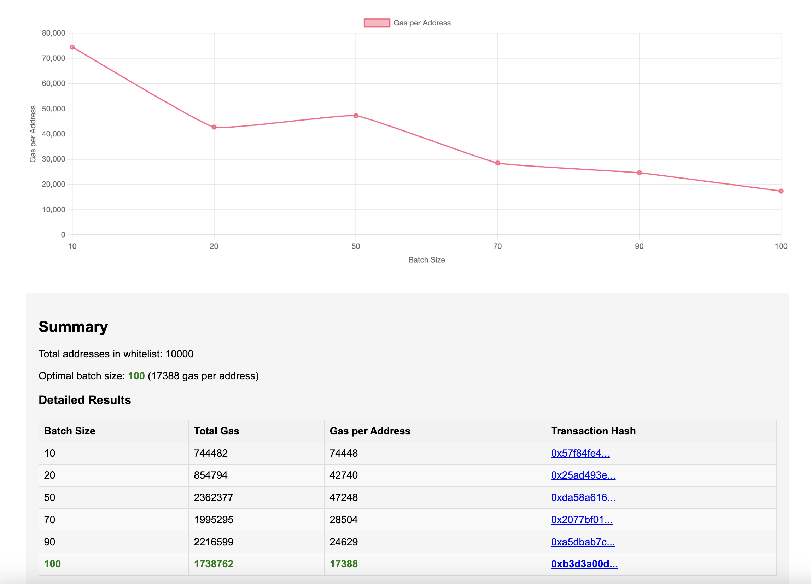

# Atherlabs ERC20 Token Airdrop Platform Documentation


## Table of Contents

1. [Introduction](#1-introduction)
2. [Setup Guide](#2-setup-guide)
   - 2.1 [Environment Setup](#21-environment-setup)
   - 2.2 [Local Deployment](#22-local-deployment)
   - 2.3 [Configuration](#23-configuration)
3. [Smart Contracts](#3-smart-contracts)
   - 3.1 [Contract Functions](#31-contract-functions)
   - 3.2 [Security Measures](#32-security-measures)
   - 3.3 [Deployment Steps](#33-deployment-steps)
   - 3.4 [Gas Optimization Strategies](#34-gas-optimization-strategies)
   - 3.5 [Script Documentation](#35-script-documentation)
4. [API Documentation](#4-api-documentation)
   - 4.1 [Endpoints](#41-endpoints)
   - 4.2 [Data Formats](#42-data-formats)
   - 4.3 [Error Codes](#43-error-codes)
   - 4.4 [Authentication](#44-authentication)
5. [Frontend Interface](#5-frontend-interface)
   - 5.1 [Key Features](#51-key-features)
   - 5.2 [User Flow](#52-user-flow)
   - 5.3 [Technical Implementation](#53-technical-implementation)
6. [Testing](#6-testing)
   - 6.1 [Smart Contract Tests](#61-smart-contract-tests)
   - 6.2 [Backend Tests](#62-backend-tests)
   - 6.3 [Frontend Tests](#63-frontend-tests)

## 1. Introduction

Atherlabs ERC20 Token Airdrop Platform is a complete decentralized application (dApp) for distributing ERC20 tokens via an efficient Merkle-tree based airdrop system. The platform consists of three main components:

1. **Smart Contracts**: Solidity contracts for token and airdrop management
2. **Backend API**: NestJS API for whitelist management and blockchain interactions
3. **Frontend dApp**: Next.js application with wallet integration for end users

The platform allows project organizers to easily distribute tokens to whitelisted users through both push (admin-initiated) and pull (user-claimed) distribution methods, while maintaining high security standards and gas efficiency.

## 2. Setup Guide

### 2.1 Environment Setup

#### Prerequisites

- Node.js v16 or higher
- Yarn package manager
- MetaMask or other Web3 wallet
- Git
- Access to Ethereum testnet (Sepolia recommended)
- Testnet ETH for gas fees

#### Development Environment

1. **Clone the repository**:
   ```bash
   git clone https://github.com/yourusername/atherlabs-test.git
   cd atherlabs-test
   ```

2. **Install dependencies for all components**:
   ```bash
   # Run the setup script to install all dependencies
   bash run-all-tests.sh
   
   # Or install dependencies for each component separately
   
   # Smart Contracts
   cd smart-contracts
   yarn install
   
   # Backend
   cd ../backend
   yarn install
   
   # Frontend
   cd ../frontend
   yarn install
   ```

### 2.2 Local Deployment

#### Smart Contract Deployment

1. **Compile the smart contracts**:
   ```bash
   cd smart-contracts
   yarn compile
   ```

2. **Deploy contracts to a local Hardhat node**:
   ```bash
   # Start a local Hardhat node in a separate terminal
   yarn node
   
   # Deploy the contracts to the local node
   yarn deploy:local
   ```

3. **Deploy contracts to testnet** (Sepolia):
   ```bash
   yarn deploy:sepolia
   ```
   This will output the deployed contract addresses, which should be copied and used in the configuration steps.

#### Backend Deployment

1. **Start the backend API**:
   ```bash
   cd backend
   yarn start:dev
   ```
   The API will be available at `http://localhost:5001/api`

2. **Build for production** (if needed):
   ```bash
   yarn build
   yarn start:prod
   ```

#### Frontend Deployment

1. **Start the frontend development server**:
   ```bash
   cd frontend
   yarn dev
   ```
   The frontend will be available at `http://localhost:3000`

2. **Build for production** (if needed):
   ```bash
   yarn build
   yarn start
   ```

### 2.3 Configuration

#### Smart Contracts Configuration

Configure the `.env` file in the `smart-contracts` directory:

```
# Network
SEPOLIA_URL=https://eth-sepolia.g.alchemy.io/v2/your-api-key
ETHEREUM_MAINNET_URL=https://eth-mainnet.g.alchemy.io/v2/your-api-key

# Private key for deployments
PRIVATE_KEY=your-private-key-here

# Etherscan API key for contract verification
ETHERSCAN_API_KEY=your-etherscan-api-key-here

# Token configuration
TOKEN_NAME=Atherlabs Token
TOKEN_SYMBOL=ATHER
TOKEN_INITIAL_SUPPLY=1000000

# Airdrop configuration
AIRDROP_AMOUNT_PER_ADDRESS=100
AIRDROP_DURATION_DAYS=30
```

#### Backend Configuration

Configure the `.env` file in the `backend` directory:

```
# Server configuration
PORT=5001
NODE_ENV=development
CORS_ORIGIN=http://localhost:3000

# Blockchain configuration
BLOCKCHAIN_RPC_URL=https://eth-sepolia.g.alchemy.io/v2/your-api-key
CHAIN_ID=11155111

# Contract addresses
TOKEN_CONTRACT_ADDRESS=0x...
AIRDROP_CONTRACT_ADDRESS=0x...

# Admin wallet
ADMIN_PRIVATE_KEY=your-admin-private-key-here

# Rate limiting
RATE_LIMIT_WINDOW_MS=60000
RATE_LIMIT_MAX=100

# Cache configuration
CACHE_TTL=60000
```

#### Frontend Configuration

Configure the `.env` file in the `frontend` directory:

```
# API URL
NEXT_PUBLIC_API_URL=http://localhost:5001/api

# Blockchain configuration
NEXT_PUBLIC_CHAIN_ID=11155111
NEXT_PUBLIC_TOKEN_CONTRACT_ADDRESS=0x...
NEXT_PUBLIC_AIRDROP_CONTRACT_ADDRESS=0x...
```

## 3. Smart Contracts

### 3.1 Contract Functions

#### AtherlabsToken.sol

The ERC20 token contract with blacklist functionality and transfer restrictions.

**Key Functions**:

- `mint(address to, uint256 amount)`: Mints new tokens to the specified address
- `blacklist(address account)`: Adds an address to the blacklist
- `removeFromBlacklist(address account)`: Removes an address from the blacklist
- `isBlacklisted(address account)`: Checks if an address is blacklisted
- `pause()`: Pauses all token transfers
- `unpause()`: Unpauses all token transfers

**Important Properties**:

- `MAX_SUPPLY`: Maximum token supply (100 million tokens with 18 decimals)
- `_blacklisted`: Mapping of blacklisted addresses

#### AtherlabsAirdrop.sol

The airdrop contract with Merkle-tree based validation for efficient distribution.

**Key Functions**:

- `claim(bytes32[] calldata proof)`: Allows eligible users to claim their tokens
- `distributeBatch(address[] calldata addresses, bytes32[][] calldata proofs)`: Distributes tokens to multiple addresses (push method)
- `updateMerkleRoot(bytes32 _merkleRoot)`: Updates the Merkle root
- `updateAirdrop(uint256 _amountPerAddress, uint256 _endTime)`: Updates airdrop parameters
- `setPaused(bool _paused)`: Pauses or unpauses the airdrop
- `emergencyWithdraw(address _token, address _to, uint256 _amount)`: Withdraws tokens in case of emergency
- `withdrawUnclaimedTokens(address _to)`: Withdraws unclaimed tokens after airdrop has ended
- `isEligible(address account, bytes32[] calldata proof)`: Checks if an address is eligible for the airdrop and hasn't claimed yet
- `getAvailableTokens()`: Returns the amount of tokens available for claiming
- `hasEnded()`: Checks if the airdrop period has ended
- `getRemainingTime()`: Returns the remaining time until the airdrop ends
- `isClaimed(address account)`: Checks if an address has claimed tokens

**Properties**:

- `token`: The ERC20 token to be distributed
- `amountPerAddress`: Amount of tokens per eligible address
- `merkleRoot`: Merkle root for verification
- `endTime`: Airdrop end timestamp
- `paused`: Whether the airdrop is paused
- `claimBitmap`: Mapping to track claimed addresses

### 3.2 Security Measures

1. **Access Control**:
   - OpenZeppelin's `Ownable` pattern is used to restrict sensitive functions
   - Function modifiers ensure only authorized users can access certain functionality

2. **Reentrancy Protection**:
   - OpenZeppelin's `ReentrancyGuard` is used to prevent reentrancy attacks
   - Functions follow the checks-effects-interactions pattern

3. **Emergency Controls**:
   - Circuit breaker pattern via `pause()`/`unpause()` functions
   - Emergency withdrawal function for recovering funds if necessary

4. **Merkle Proof Verification**:
   - Using Merkle trees for whitelist validation

5. **Safe Token Interactions**:
   - OpenZeppelin's `SafeERC20` library prevents common ERC20 vulnerabilities but increases gas (~1,000-3,000 extra gas per transfer)
   - Proper checking of token transfer results

6. **Mathematic Safety**:
   - Using Solidity 0.8.x with built-in overflow/underflow protection
   - Proper validation of numeric inputs

### 3.4 Gas Optimization Strategies

The contracts implement several gas optimization strategies:

1. **Storage Optimization**:
   - Using bitmap for tracking claimed addresses, which is more gas-efficient than individual booleans
   - Immutable variables for values set at construction
   - Proper storage packing to minimize storage slots

2. **Custom Errors**:
   - Using custom errors instead of revert strings to save gas
   - Descriptive error messages that clearly explain what went wrong

4. **Batch Operations**:
   - The `distributeBatch` function allows efficient mass distribution of tokens
   - Limits to prevent hitting gas limits while still optimizing for efficiency

6. **Input Validation**:
   - Efficient checks for zero-address, zero-amount, etc.
   - Using `if` statements with custom errors rather than `require` statements

### 3.5 Script Documentation

#### Merkle Tree Utilities

- **Generate Merkle Root (`yarn generate-merkle`)**
    - **Purpose**: Generates a Merkle root from a list of addresses.
    - **Description**: Creates a Merkle tree and root hash from a list of whitelisted addresses for efficient verification.
    - **Usage**: `cd smart-contracts && yarn generate-merkle --file <path-to-csv>`
    - **Input**: CSV file with one Ethereum address per line.
    - **Output**: Saves Merkle tree data to `data/whitelist.json`.

- **Generate Test Addresses (`yarn generate-test-addresses`)**
    - **Purpose**: Creates test addresses for development and testing.
    - **Description**: Generates a specified number of Ethereum addresses for testing purposes.
    - **Usage**: `cd smart-contracts && yarn generate-test-addresses --count <number-of-addresses>`
    - **Output**: Saves generated addresses to `data/test-addresses.json`.

- **Setup and Benchmark (`yarn setup-and-benchmark`)**
    - **Purpose**: Runs a complete setup followed by benchmarking.
    - **Description**: All-in-one command to deploy, set up, and benchmark the contracts.
    - **Usage**: `cd smart-contracts && yarn setup-and-benchmark`
    - **Output**: Saves complete benchmark report to `data/benchmark-report.json`, `data/batch-benchmark-chart.html`.



## 4. API Documentation

### 4.1 Endpoints

The backend API provides several endpoints for interacting with the blockchain and managing the whitelist:

#### Blockchain Endpoints

| Endpoint | Method | Description |
|----------|--------|-------------|
| `/api/blockchain/claim-status/:address` | GET | Check if address has claimed tokens |
| `/api/blockchain/eligibility/:address` | GET | Check if an address is eligible for claiming tokens with detailed response |
| `/api/blockchain/claim-events/:address` | GET | Get all claim events for a specific address |
| `/api/blockchain/allocation/:address` | GET | Get allocation amount for a specific address |
| `/api/blockchain/distribution-progress` | GET | Get overall distribution progress statistics |
| `/api/blockchain/gas-analytics` | GET | Get gas usage statistics and analytics |

#### Admin Blockchain Endpoints (Protected)

| Endpoint | Method | Description |
|----------|--------|-------------|
| `/api/blockchain/update-airdrop` | POST | Update airdrop parameters (amount per address, end time) |
| `/api/blockchain/set-paused` | POST | Pause or unpause the airdrop contract |
| `/api/blockchain/emergency-withdraw` | POST | Emergency withdrawal of tokens from the contract |

#### Whitelist Endpoints (Protected)

| Endpoint | Method | Description |
|----------|--------|-------------|
| `/api/whitelist` | GET | Get all whitelisted addresses |
| `/api/whitelist/merkle-root` | GET | Get current merkle root |
| `/api/whitelist/:address` | GET | Check if address is whitelisted |
| `/api/whitelist/add` | POST | Add addresses to whitelist |
| `/api/whitelist/remove` | POST | Remove addresses from whitelist |

### 4.2 Data Formats

#### Request Formats

**JSON Body Example for `/api/whitelist/add`**:
```json
{
  "addresses": [
    {
      "address": "0x123...",
      "amount": "100000000000000000000"
    },
    {
      "address": "0x456...",
      "amount": "100000000000000000000"
    }
  ]
}
```

**JSON Body Example for `/api/whitelist/remove`**:
```json
{
  "addresses": ["0x123...", "0x456..."]
}
```

#### Response Formats

**Response Format for `/api/blockchain/token-info`**:
```json
{
  "name": "Atherlabs Token",
  "symbol": "ATHER",
  "decimals": 18,
  "totalSupply": "100000000000000000000000",
  "formattedTotalSupply": "100000"
}
```

**Response Format for `/api/blockchain/eligibility/:address`**:
```json
{
  "address": "0x123...",
  "isEligible": true,
  "isClaimed": false,
  "proof": ["0xabc...", "0xdef..."],
  "amount": "100000000000000000000",
  "formattedAmount": "100"
}
```

**Response Format for `/api/blockchain/gas-analytics`**:
```json
{
  "averageGasUsed": 150000,
  "totalGasUsed": 3000000,
  "claimCount": 20,
  "batchDistributionCount": 5,
  "averageGasPrice": "50000000000",
  "estimatedCostInEth": "0.0075"
}
```

### 4.4 Authentication

The API uses a simple API key authentication for admin endpoints that modify the whitelist or trigger transactions:

1. **API Key Authentication**:
   - API keys should be `admin_key` key in header
   - Format: `YOUR_API_KEY`

## 5. Frontend Interface

### 5.1 Key Features

The frontend interface provides a user-friendly way to interact with the airdrop:

1. **Wallet Connection**:
   - Connect with MetaMask and other popular Web3 wallets
   - Displays current connection status and network

2. **Eligibility Checking**:
   - Check if an address is eligible for the airdrop
   - Shows proof details and allocation amount

3. **Token Balance Display**:
   - Shows current token balance after claiming
   - Provides readable formatting with correct decimals

4. **Claim Interface**:
   - Simple one-click process to claim tokens
   - Transaction status tracking

5. **History and Analytics**:
   - Shows history of previous claims
   - Displays claim status and transaction details

### 5.2 User Flow

1. **Connect Wallet**:
   - User connects their wallet using the "Connect Wallet" button
   - System validates the connected network

2. **Check Eligibility**:
   - System automatically checks if the connected address is eligible
   - If eligible, shows allocation amount and claim status

3. **Claim Tokens**:
   - Eligible users can claim tokens with the "Claim" button
   - Users sign and confirm the transaction in their wallet

4. **Transaction Status**:
   - System shows transaction status (pending, confirmed, failed)
   - On success, displays the claimed token amount

5. **View History**:
   - Users can view their claim history
   - Shows transaction hashes for verification

### 5.3 Technical Implementation

1. **Framework and Libraries**:
   - Next.js 14 with App Router for routing and server components
   - ethers.js for blockchain interactions
   - shadcn/ui components for UI elements
   - TailwindCSS for styling
   - SWR for data fetching

2. **State Management**:
   - React Context for wallet and blockchain state
   - SWR for caching and revalidation of API responses

3. **Responsive Design**:
   - Mobile-first approach
   - Optimized for different screen sizes

4. **Web3 Integration**:
   - Ethers.js for interacting with smart contracts
   - Custom hooks for blockchain functionality

## 6. Testing

### 6.1 Smart Contract Tests

The smart contracts are thoroughly tested to ensure correct behavior:

1. **Unit Tests**:
   - Test individual contract functions
   - Edge cases and input validation
   - Gas optimization

2. **Integration Tests**:
   - Test interactions between contracts
   - Complex scenarios

3. **Security Tests**:
   - Access control validation
   - Reentrancy protection
   - Input validation

To run the smart contract tests:
```bash
cd smart-contracts
yarn test
```

### 6.2 Backend Tests

The backend API is tested to ensure correct functionality:

1. **Unit Tests**:
   - Controller tests
   - Service tests
   - Utility function tests

2. **Integration Tests**:
   - API endpoint tests
   - Database interaction tests

3. **End-to-End Tests**:
   - Complete API workflows

To run the backend tests:
```bash
cd backend
yarn test
```

### 6.3 Frontend Tests

The frontend is tested to ensure a good user experience:

1. **Unit Tests**:
   - Component tests
   - Hook tests
   - Utility function tests

2. **Integration Tests**:
   - User flow tests
   - State management tests

3. **End-to-End Tests**:
   - Complete user workflows

To run the frontend tests:
```bash
cd frontend
yarn test
```


